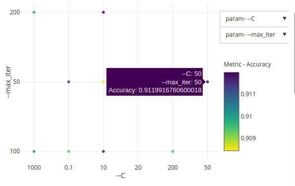
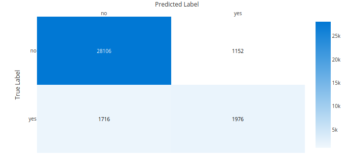
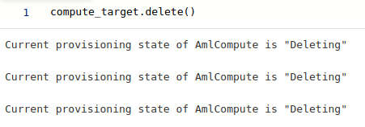

# Optimizing an ML Pipeline in Azure

## Overview
This project is part of the Udacity Azure ML Nanodegree.
In this project, we build and optimize an Azure ML pipeline using the Python SDK and a provided Scikit-learn model.
This model is then compared to an Azure AutoML run.

## Summary
**In 1-2 sentences, explain the problem statement:**

This datatset contains data about bank customers including their job, marital status, housing..etc. we seek to predict if a spcefic person is eligible to take a loan or not. Which mean that this is a calassifcation problem with two classes.

**In 1-2 sentences, explain the solution:**
The best performing model reached an **accuracy of  0.9119916760600018** with the hyperparameters of **max iterations eqaul 50** and **inverse regularization equal 50(Regulariation eqaul 0.02)**.

## Scikit-learn Pipeline
**Explain the pipeline architecture, including data, hyperparameter tuning, and classification algorithm.**
The data includes information about bank cutomers like their job, education, marital status, housing, salary.., and the label "y" which takes yes or no as values, this indicates whether the customer is eligible for taking a loan or not.

We tuning two hyperparameters which are **regularization** and **maximum number of iterations**, the primary metric used is **accuracy**. For the calssification algorithm we using **Logistic Regression**. 

**What are the benefits of the parameter sampler you chose?**
The random parameter sampler supports discrete values and values distributed over a continuous range, furthermore it gives almost the same performance as Grid sampling which consumes more time.

**What are the benefits of the early stopping policy you chose?**
Early stopping used in this project was Bandit policy which evaluate the result every 100 iteration and drops the runs that don't perform good enough.

As explained in [microsoft documentation](https://docs.microsoft.com/en-us/python/api/azureml-train-core/azureml.train.hyperdrive.banditpolicy?view=azure-ml-py):

Consider a Bandit policy with slack_factor = 0.2 and evaluation_interval = 100. Assume that run X is the currently best performing run with an AUC (performance metric) of 0.8 after 100 intervals. Further, assume the best AUC reported for a run is Y. This policy compares the value (Y + Y * 0.2) to 0.8, and if smaller, cancels the run. If delay_evaluation = 200, then the first time the policy will be applied is at interval 200.

## AutoML
**In 1-2 sentences, describe the model and hyperparameters generated by AutoML.**
The best model selected by AutoML reached an **accuracy of 0.912959028831563** and **AUC weighted of 0.9470720159066244** and **the algorithm MaxAbsScaler, LightGBM**.

## Pipeline comparison
**Compare the two models and their performance. What are the differences in accuracy? In architecture? If there was a difference, why do you think there was one?**

The results achieved by AutoML are slighlty better than the results achieved by sckiit-learn pipeline using hyperdrive. Also I find the AutoML pipeline more easy to setup and it takes away a lot of configurations from the data scientist, in the other side the hyperdrive necessists more work to do. Also the AutoML tests many algorithms without any further configuration but with hyperdrive you should explicitly test every algorithm.

Also when activating featurization AutoML detects that the dataset has an imbalanced classes, so for that using AUC-weighted helps dealing with the issue.

## Future work
**What are some areas of improvement for future experiments? Why might these improvements help the model?**
Try to explore more hyperparameters tunning for hyperdrive which could lead to a better performance. Testing different parameters with AzureML could lead to a better accuracy too.

## Proof of cluster clean up
Added compute_target.delete() at the end of the notebook.

**Image of cluster marked for deletion**

